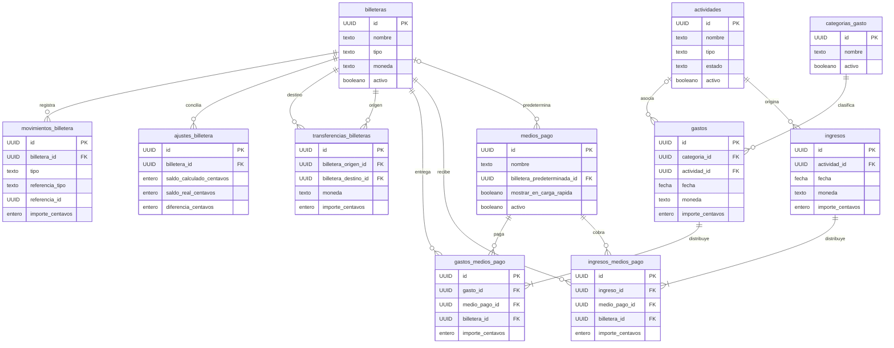

# Modelo de datos

Este documento describe el modelo de datos vigente de AppBilletera y las reglas que deben respetar todas las implementaciones de persistencia.

El esquema base se define en:

```text
src/database/migrations/v1.ts
```

mediante una definición común que debe poder ser interpretada por los distintos adaptadores de persistencia.

Motores previstos:

```text
Web     → IndexedDB
Nativo  → SQLite
```

Las capas superiores de la aplicación no deben depender directamente del motor utilizado.

Las entidades TypeScript se encuentran en:

```text
src/core/entities/
```

y comparten, cuando corresponde, la base:

```text
EntidadAuditada
```

Las propiedades del dominio utilizan `camelCase` en español:

```text
actividadId
importeCentavos
creadoEn
billeteraId
```

Las columnas persistidas utilizan `snake_case`:

```text
actividad_id
importe_centavos
creado_en
billetera_id
```

La conversión entre ambos formatos corresponde a la infraestructura de persistencia.

---

# 1. Principios generales

El modelo debe respetar los siguientes principios:

1. funcionamiento local-first;
2. UUID generados localmente;
3. dinero almacenado como enteros;
4. trazabilidad de movimientos;
5. preservación histórica;
6. separación entre resultado y patrimonio;
7. idempotencia;
8. independencia del motor de persistencia;
9. capacidad futura de sincronización cloud.

---

# 2. Identidad de registros

Todas las entidades principales utilizan:

```text
id
```

como clave primaria.

El `id` contiene directamente un UUID.

Ejemplo:

```text
550e8400-e29b-41d4-a716-446655440000
```

No utilizar:

```text
id
uuid
```

simultáneamente.

No utilizar IDs autoincrementales como identidad principal.

Cuando sea compatible:

```ts
crypto.randomUUID()
```

debe utilizarse para generar la identidad local.

La finalidad es que un registro pueda crearse completamente offline y conservar la misma identidad posteriormente en:

- IndexedDB;
- SQLite;
- futuras APIs;
- futura base cloud.

---

# 3. Claves foráneas

Las relaciones utilizan el formato:

```text
<entidad>_id
```

Ejemplos:

```text
actividad_id
categoria_id
medio_pago_id
billetera_id
ingreso_id
gasto_id

billetera_origen_id
billetera_destino_id
```

No utilizar:

```text
id_actividad
id_categoria
id_billetera
```

---

# 4. Auditoría

Utilizar cuando corresponda:

```text
creado_en
actualizado_en
eliminado_en
```

Los instantes de auditoría se representan como ISO 8601.

Preferentemente:

```text
UTC
```

Ejemplo:

```text
2026-10-02T21:30:00.000Z
```

Las fechas que representan días de calendario y no instantes utilizan:

```text
AAAA-MM-DD
```

Ejemplo:

```text
2026-10-02
```

Esto aplica a:

- ingresos;
- gastos;
- transferencias;
- fechas de actividades;
- conciliaciones cuando conceptualmente corresponda a un día.

La ausencia de un dato opcional debe representarse explícitamente mediante:

```text
null
```

cuando corresponda.

---

# 5. Borrado lógico

No eliminar físicamente registros utilizados históricamente.

Utilizar:

```text
eliminado_en
```

y/o:

```text
activo
```

según el tipo de entidad.

Ejemplo:

una categoría desactivada:

```text
Combustible
activo = false
```

no debe aparecer al crear un gasto nuevo.

Sin embargo, debe seguir mostrándose correctamente en gastos históricos.

Lo mismo aplica a:

- actividades;
- categorías;
- medios de pago;
- billeteras.

Las relaciones históricas no deben desaparecer por cambios posteriores de configuración.

---

# 6. Dinero

Nunca persistir dinero mediante:

```text
float
double
decimal de punto flotante
```

Los importes se almacenan como enteros en unidades monetarias menores.

Campo habitual:

```text
importe_centavos
```

Ejemplo:

```text
$1.500,25
```

se almacena como:

```text
150025
```

Moneda inicial:

```text
ARS
```

La arquitectura debe permitir incorporar otras monedas en el futuro.

---

# 7. Moneda

Ingresos y gastos contienen su moneda.

Los detalles heredan conceptualmente la moneda de su cabecera.

Las billeteras tienen una moneda definida.

Un detalle de ingreso o gasto solo puede utilizar una billetera compatible con la moneda de la operación.

Las transferencias entre billeteras solo pueden realizarse entre billeteras de la misma moneda.

No se implementa conversión de divisas en V1.

Ejemplo válido:

```text
Efectivo ARS
→ Banco Galicia ARS
```

Ejemplo no soportado directamente:

```text
Efectivo ARS
→ Billetera USD
```

Una conversión futura debe modelarse como una operación específica y no como una transferencia normal.

---

# 8. Entidades principales

| Entidad | Propósito y relaciones |
| --- | --- |
| `Actividad` | Fuente de ingresos, trabajo o proyecto. Puede relacionarse con ingresos y gastos. |
| `MedioPago` | Describe cómo se pagó o cobró. Puede sugerir una billetera predeterminada. |
| `CategoriaGasto` | Clasifica gastos. |
| `Billetera` | Representa dónde se encuentra el dinero. |
| `Ingreso` | Registro de una entrada de dinero asociada a una actividad. |
| `DetalleIngresoMedioPago` | Distribuye un ingreso entre medios de pago y billeteras reales. |
| `Gasto` | Registro de una salida de dinero, con categoría y actividad opcional. |
| `DetalleGastoMedioPago` | Distribuye un gasto entre medios de pago y billeteras reales. |
| `TransferenciaBilletera` | Movimiento interno entre dos billeteras. |
| `MovimientoBilletera` | Entrada o salida que constituye la fuente de verdad del saldo. |
| `AjusteBilletera` | Diferencia registrada durante una conciliación. |

---

# 9. Actividades

Tabla:

```text
actividades
```

Campos principales:

```text
id
nombre
tipo
descripcion
icono
color
fecha_inicio
fecha_fin
estado
activo
creado_en
actualizado_en
eliminado_en
```

Una actividad puede representar:

```text
DiDi
Uber
Fotografía
Programación
Venta
Pintura departamento
Trabajo temporal
Trabajo fijo
Servicio
```

Una actividad puede tener:

```text
0..N ingresos
0..N gastos
```

Un gasto puede no estar asociado a ninguna actividad.

---

# 10. Categorías de gastos

Tabla:

```text
categorias_gasto
```

Campos principales:

```text
id
nombre
icono
color
activo
creado_en
actualizado_en
eliminado_en
```

Relación:

```text
categorias_gasto.id
        ↑
        │
gastos.categoria_id
```

Una categoría desactivada continúa siendo válida para registros históricos.

---

# 11. Billeteras

Tabla:

```text
billeteras
```

Campos principales:

```text
id
nombre
tipo
icono
color
moneda
activo
conciliado_en
creado_en
actualizado_en
eliminado_en
```

Una billetera representa dónde está el dinero.

Ejemplos:

```text
Efectivo
Mercado Pago
Banco Galicia
Cuenta DNI
Ualá
```

El saldo no se guarda como un valor histórico editable directamente.

La fuente de verdad es:

```text
movimientos_billetera
```

---

# 12. Medios de pago

Tabla:

```text
medios_pago
```

Campos principales:

```text
id
nombre
icono
color
mostrar_en_carga_rapida
orden
billetera_predeterminada_id
activo
creado_en
actualizado_en
eliminado_en
```

Ejemplos:

```text
Efectivo
Transferencia
Tarjeta
```

Un medio de pago describe:

```text
cómo
```

se pagó o cobró.

Una billetera describe:

```text
dónde
```

está o salió el dinero.

Ejemplo:

```text
Medio de pago:
Transferencia

Billetera:
Banco Galicia
```

---

# 13. Billetera predeterminada de un medio de pago

El campo:

```text
medios_pago.billetera_predeterminada_id
```

es una configuración de interfaz y carga rápida.

Su finalidad es sugerir una billetera al crear una nueva operación.

Ejemplo:

```text
Transferencia
→ Banco Galicia
```

No debe utilizarse posteriormente para reconstruir relaciones históricas.

Ejemplo:

el 1 de octubre se registra:

```text
Transferencia
$50.000
Banco Galicia
```

Posteriormente el usuario cambia:

```text
Transferencia
→ Mercado Pago
```

El ingreso anterior debe continuar asociado a:

```text
Banco Galicia
```

Por esta razón cada detalle monetario guarda explícitamente la billetera realmente utilizada.

---

# 14. Ingresos

Tabla:

```text
ingresos
```

Campos principales:

```text
id
actividad_id
fecha
descripcion
observaciones
moneda
importe_centavos
creado_en
actualizado_en
eliminado_en
```

Un ingreso pertenece a una actividad.

Relación:

```text
actividades.id
      ↑
      │
ingresos.actividad_id
```

El campo:

```text
importe_centavos
```

representa el total del ingreso.

Debe ser igual a la suma de sus detalles activos.

---

# 15. Detalles de ingreso

Tabla:

```text
ingresos_medios_pago
```

Campos principales:

```text
id
ingreso_id
medio_pago_id
billetera_id
importe_centavos
creado_en
actualizado_en
eliminado_en
```

Relaciones:

```text
ingreso_id
→ ingresos.id
```

```text
medio_pago_id
→ medios_pago.id
```

```text
billetera_id
→ billeteras.id
```

## Regla importante

```text
billetera_id
```

representa la billetera realmente utilizada en esa operación.

No debe reconstruirse posteriormente utilizando:

```text
medios_pago.billetera_predeterminada_id
```

## Obligatoriedad

En el modelo financiero actual:

```text
billetera_id
```

es obligatorio para todo detalle monetario persistido.

Todo dinero recibido debe ingresar a alguna billetera.

Ejemplo:

```text
Ingreso DiDi
Total: $55.000
```

Detalles:

```text
Efectivo
Billetera: Efectivo
$35.000
```

```text
Transferencia
Billetera: Banco Galicia
$20.000
```

Entonces:

```text
35000 + 20000 = 55000
```

---

# 16. Gastos

Tabla:

```text
gastos
```

Campos principales:

```text
id
categoria_id
actividad_id
fecha
descripcion
observaciones
moneda
importe_centavos
creado_en
actualizado_en
eliminado_en
```

Relación obligatoria:

```text
categoria_id
→ categorias_gasto.id
```

Relación opcional:

```text
actividad_id
→ actividades.id
```

El campo:

```text
importe_centavos
```

representa el total del gasto.

Debe ser igual a la suma de sus detalles activos.

---

# 17. Detalles de gasto

Tabla:

```text
gastos_medios_pago
```

Campos principales:

```text
id
gasto_id
medio_pago_id
billetera_id
importe_centavos
creado_en
actualizado_en
eliminado_en
```

Relaciones:

```text
gasto_id
→ gastos.id
```

```text
medio_pago_id
→ medios_pago.id
```

```text
billetera_id
→ billeteras.id
```

La billetera corresponde a la ubicación real desde donde salió el dinero.

Ejemplo:

```text
Gasto combustible
Total: $50.000
```

Detalles:

```text
Efectivo
Billetera: Efectivo
$20.000
```

```text
Tarjeta
Billetera: Ualá
$30.000
```

Entonces:

```text
20000 + 30000 = 50000
```

El cambio futuro de configuración del medio de pago no debe modificar esta relación histórica.

---

# 18. Transferencias entre billeteras

Tabla:

```text
transferencias_billeteras
```

Campos principales:

```text
id
billetera_origen_id
billetera_destino_id
importe_centavos
moneda
fecha
descripcion
creado_en
actualizado_en
eliminado_en
```

Reglas:

```text
billetera_origen_id != billetera_destino_id
```

```text
importe_centavos > 0
```

Ambas billeteras deben utilizar la misma moneda.

Ejemplo:

```text
Efectivo
→ Banco Galicia

$100.000
```

La transferencia genera:

```text
Efectivo       -100000
Banco Galicia  +100000
```

No genera:

```text
ingreso
gasto
ganancia
pérdida
```

El patrimonio total permanece igual.

---

# 19. Ajustes de billetera

Tabla:

```text
ajustes_billetera
```

Campos principales:

```text
id
billetera_id
fecha
saldo_calculado_centavos
saldo_real_centavos
diferencia_centavos
motivo
observaciones
creado_en
actualizado_en
eliminado_en
```

La diferencia se calcula como:

```text
saldo_real_centavos
-
saldo_calculado_centavos
```

Ejemplo:

```text
Saldo calculado: 65000
Saldo real:      50000

Diferencia:
-15000
```

Si:

```text
diferencia_centavos < 0
```

el movimiento correspondiente es:

```text
AJUSTE_NEGATIVO
```

Si:

```text
diferencia_centavos > 0
```

el movimiento correspondiente es:

```text
AJUSTE_POSITIVO
```

Una diferencia:

```text
0
```

no genera un ajuste financiero.

Los ajustes no son automáticamente ingresos ni gastos.

---

# 20. Movimientos de billetera

Tabla:

```text
movimientos_billetera
```

Esta tabla constituye la fuente de verdad para reconstruir los saldos de billeteras.

Campos principales:

```text
id
billetera_id
tipo
referencia_tipo
referencia_id
importe_centavos
fecha
descripcion
creado_en
```

Los movimientos normalmente no se editan directamente desde la interfaz.

Representan el impacto financiero derivado de otras operaciones.

---

# 21. Signo de movimientos

Convención:

```text
positivo → entrada de dinero
negativo → salida de dinero
```

Ejemplos:

```text
SALDO_INICIAL          +100000
INGRESO                 +35000
GASTO                    -20000
TRANSFERENCIA_ENTRADA   +100000
TRANSFERENCIA_SALIDA    -100000
AJUSTE_POSITIVO          +15000
AJUSTE_NEGATIVO          -15000
```

---

# 22. Tipos de movimientos

Tipos iniciales:

```text
SALDO_INICIAL
INGRESO
GASTO
TRANSFERENCIA_ENTRADA
TRANSFERENCIA_SALIDA
AJUSTE_POSITIVO
AJUSTE_NEGATIVO
```

No utilizar strings arbitrarios fuera de los tipos reconocidos por el dominio.

---

# 23. Referencias de movimientos

Los movimientos utilizan una referencia polimórfica mediante:

```text
referencia_tipo
referencia_id
```

No existe una única FK física porque el movimiento puede provenir de distintos tipos de operaciones.

## Ingresos

Para ingresos, el movimiento debe referenciar preferentemente el detalle específico que produjo el impacto.

Ejemplo:

```text
referencia_tipo = INGRESO_MEDIO_PAGO
referencia_id   = ingresos_medios_pago.id
```

Esto permite identificar exactamente:

```text
qué medio
qué billetera
qué importe
```

originó el movimiento.

## Gastos

Para gastos:

```text
referencia_tipo = GASTO_MEDIO_PAGO
referencia_id   = gastos_medios_pago.id
```

## Transferencias

Para transferencias:

```text
referencia_tipo = TRANSFERENCIA
referencia_id   = transferencias_billeteras.id
```

Una transferencia produce dos movimientos:

```text
TRANSFERENCIA_SALIDA
TRANSFERENCIA_ENTRADA
```

con la misma referencia de transferencia.

## Ajustes

Para ajustes:

```text
referencia_tipo = AJUSTE
referencia_id   = ajustes_billetera.id
```

## Saldo inicial

Para saldo inicial puede utilizarse una referencia específica si existe una entidad que lo representa.

Mientras no exista una entidad independiente, la referencia puede ser:

```text
null
```

siempre que el movimiento:

```text
SALDO_INICIAL
```

continúe siendo inequívoco y trazable mediante su billetera, fecha y descripción.

---

# 24. Idempotencia

La persistencia de operaciones financieras debe ser idempotente.

Ejemplo incorrecto:

una misma línea de ingreso no puede producir accidentalmente:

```text
Movimiento +35000
Movimiento +35000
```

por reintentar la operación.

Debe existir una estrategia que permita detectar que el impacto ya fue generado.

Para movimientos derivados, utilizar conceptualmente:

```text
referencia_tipo
referencia_id
tipo
```

como identidad lógica.

Cuando el motor lo permita, utilizar una restricción equivalente a:

```text
UNIQUE(
    referencia_tipo,
    referencia_id,
    tipo
)
```

## Ejemplo ingreso

Detalle:

```text
id = detalle-123
```

Movimiento:

```text
tipo             = INGRESO
referencia_tipo  = INGRESO_MEDIO_PAGO
referencia_id    = detalle-123
```

No debe poder existir un segundo movimiento `INGRESO` válido con esa misma referencia.

## Ejemplo transferencia

La misma referencia sí puede aparecer dos veces porque los tipos son distintos:

```text
referencia_id = transferencia-456

TRANSFERENCIA_SALIDA
TRANSFERENCIA_ENTRADA
```

Por eso el tipo forma parte de la identidad lógica.

---

# 25. Integridad de una operación

Una operación financiera debe persistirse de manera atómica cuando el motor lo permita.

Ejemplo de ingreso:

```text
Ingreso
   +
Detalles
   +
Movimientos de billetera
```

deben considerarse una única operación lógica.

No debe quedar:

```text
ingreso guardado
pero movimiento faltante
```

ni:

```text
movimiento guardado
pero detalle inexistente
```

Lo mismo aplica a:

- gastos;
- transferencias;
- ajustes;
- saldo inicial.

Si una parte crítica falla:

```text
ROLLBACK
```

o comportamiento transaccional equivalente.

---

# 26. Integridad de ingresos

Para un ingreso:

```text
ingresos.importe_centavos
```

debe ser igual a:

```text
SUM(
    ingresos_medios_pago.importe_centavos
)
```

de los detalles activos.

Cada detalle debe cumplir:

```text
importe_centavos > 0
```

No persistir detalles de importe cero.

Ejemplo:

```text
Efectivo       35000
Transferencia      0
Tarjeta        15000
```

Persistir solamente:

```text
Efectivo       35000
Tarjeta        15000
```

Total:

```text
50000
```

---

# 27. Integridad de gastos

Para un gasto:

```text
gastos.importe_centavos
```

debe ser igual a:

```text
SUM(
    gastos_medios_pago.importe_centavos
)
```

de los detalles activos.

No persistir detalles cuyo importe sea:

```text
0
```

No permitir un gasto cuyo total sea:

```text
0
```

---

# 28. Integridad entre billetera y moneda

Para cada detalle de ingreso o gasto:

```text
detalle.billetera_id
```

debe apuntar a una billetera cuya moneda coincida con:

```text
ingreso.moneda
```

o:

```text
gasto.moneda
```

respectivamente.

Ejemplo válido:

```text
Ingreso ARS
→ Banco Galicia ARS
```

Ejemplo inválido:

```text
Ingreso ARS
→ Billetera USD
```

sin una operación explícita de conversión.

---

# 29. Billetera predeterminada versus billetera histórica

Debe mantenerse siempre esta separación:

```text
medios_pago.billetera_predeterminada_id
```

significa:

```text
billetera sugerida actualmente
```

Mientras:

```text
ingresos_medios_pago.billetera_id
gastos_medios_pago.billetera_id
```

significan:

```text
billetera realmente utilizada históricamente
```

Nunca recalcular datos históricos a partir de la configuración actual.

---

# 30. Fuente de verdad del saldo

La fuente de verdad del saldo de una billetera es:

```text
movimientos_billetera
```

Conceptualmente:

```text
saldo =
SUM(movimientos_billetera.importe_centavos)
```

para los movimientos válidos de la billetera.

No calcular este saldo descargando todo el historial en JavaScript.

La agregación corresponde a la capa de persistencia.

---

# 31. Saldo actual optimizado

En el futuro puede existir:

```text
saldo_actual_centavos
```

como cache.

Si se incorpora:

- no reemplaza a `movimientos_billetera`;
- debe actualizarse de forma consistente;
- debe poder reconstruirse;
- su pérdida no debe implicar pérdida de información financiera.

No incorporarlo únicamente por conveniencia si no existe una necesidad medida.

---

# 32. Saldos históricos

La estrategia detallada de saldos históricos se documenta en:

```text
docs/SALDOS_HISTORICOS.md
```

La arquitectura puede incorporar en el futuro:

```text
saldos_billetera_periodo
```

para evitar recorrer una historia completa cuando el volumen lo justifique.

Conceptualmente:

```text
id
billetera_id
anio
mes
saldo_inicial_centavos
entradas_centavos
salidas_centavos
saldo_final_centavos
calculado_en
```

Esta optimización no reemplaza la fuente de verdad.

---

# 33. Índices mínimos

Los índices financieros deben estar definidos en:

```text
src/database/migrations/indicesV1.ts
```

Como mínimo:

```text
movimientos_billetera(billetera_id, fecha)
```

Permite consultar movimientos y saldos por billetera y período.

```text
movimientos_billetera(referencia_tipo, referencia_id)
```

Permite localizar impactos financieros derivados de una operación.

```text
ingresos(fecha)
```

```text
gastos(fecha)
```

Permiten reportes temporales.

```text
ingresos(actividad_id, fecha)
```

Permite rentabilidad e ingresos por actividad.

```text
gastos(actividad_id, fecha)
```

Permite calcular gastos asociados a actividades.

```text
gastos(categoria_id, fecha)
```

Permite reportes por categoría.

También pueden existir:

```text
ingresos_medios_pago(ingreso_id)
gastos_medios_pago(gasto_id)
```

para resolver detalles desde sus cabeceras.

Cuando sea útil para consultas reales:

```text
ingresos_medios_pago(billetera_id)
gastos_medios_pago(billetera_id)
```

No crear índices indiscriminadamente.

---

# 34. Operaciones monetarias

Las operaciones de dinero se centralizan en:

```text
src/core/money/Importe.ts
```

Las funciones monetarias deben:

- aceptar enteros seguros;
- validar moneda;
- impedir mezclas de moneda;
- evitar pérdida de precisión;
- rechazar valores no finitos;
- rechazar resultados fuera del rango seguro soportado.

Los cálculos pueden utilizar `BigInt` internamente cuando corresponda.

No persistir `BigInt` directamente si el adaptador no lo soporta de forma consistente.

La representación persistida continúa siendo un entero seguro.

---

# 35. Interpretación de importes

La interpretación del texto ingresado por el usuario debe centralizarse en:

```text
src/core/money/interpretarImporte.ts
```

No duplicar lógica de interpretación monetaria dentro de formularios React.

Ejemplos visuales:

```text
1.500
1.500,25
1500,25
```

deben convertirse mediante una única política documentada antes de llegar a persistencia.

---

# 36. Formateo monetario

El formateo visual se encuentra separado de la lógica de dominio.

Referencia:

```text
src/shared/money/formatearImporte.ts
```

Configuración inicial:

```text
locale: es-AR
moneda: ARS
```

El formateo:

- no modifica el valor almacenado;
- no introduce redondeos persistentes;
- debe representar correctamente importes negativos;
- debe conservar los centavos disponibles.

---

# 37. Resultado versus patrimonio

El modelo diferencia explícitamente:

## Resultado

```text
Ingresos
-
Gastos
=
Ganancia neta
```

## Patrimonio

```text
SUM(saldos de billeteras)
```

## Movimientos internos

```text
Transferencias
Ajustes
```

Una transferencia:

```text
Efectivo → Galicia
```

no genera ingreso ni gasto.

Un ajuste modifica el patrimonio registrado, pero no se considera automáticamente ingreso ni gasto.

---

# 38. Conciliación

Una conciliación compara:

```text
saldo calculado
```

con:

```text
saldo real
```

Ejemplo:

```text
Saldo calculado: 65000
Saldo real:      50000
Diferencia:     -15000
```

La aplicación puede resolverlo mediante:

```text
Registrar movimiento faltante
```

o:

```text
Ajustar diferencia
```

Si se identifica un gasto o ingreso real faltante, debe registrarse la operación real.

Solo cuando corresponda debe crearse:

```text
AJUSTE_POSITIVO
```

o:

```text
AJUSTE_NEGATIVO
```

No editar directamente el saldo de la billetera.

---

# 39. Diagrama de relaciones



La relación polimórfica de:

```text
movimientos_billetera
```

con sus operaciones de origen no aparece como FK física múltiple.

Se representa mediante:

```text
referencia_tipo
referencia_id
```

---

# 40. Resumen del flujo de ingreso

Ejemplo:

```text
Actividad
DiDi
```

↓

```text
Ingreso
$55.000
```

↓

```text
Detalle A
Efectivo
Billetera Efectivo
$35.000
```

↓

```text
Movimiento
INGRESO
Efectivo
+$35.000
```

y:

```text
Detalle B
Transferencia
Banco Galicia
$20.000
```

↓

```text
Movimiento
INGRESO
Banco Galicia
+$20.000
```

Resultado:

```text
Ingresos:
+$55.000

Patrimonio:
+$55.000
```

---

# 41. Resumen del flujo de gasto

Ejemplo:

```text
Categoría:
Combustible

Actividad:
DiDi
```

↓

```text
Gasto
$20.000
```

↓

```text
Detalle
Efectivo
Billetera Efectivo
$20.000
```

↓

```text
Movimiento
GASTO
Efectivo
-$20.000
```

Resultado:

```text
Gastos:
+$20.000

Patrimonio:
-$20.000
```

---

# 42. Resumen del flujo de transferencia

```text
Transferencia
Efectivo → Galicia
$100.000
```

genera:

```text
Movimiento A

tipo:
TRANSFERENCIA_SALIDA

billetera:
Efectivo

importe:
-100000
```

y:

```text
Movimiento B

tipo:
TRANSFERENCIA_ENTRADA

billetera:
Galicia

importe:
+100000
```

Resultado:

```text
Ganancia:
sin cambios

Patrimonio total:
sin cambios
```

---

# 43. Compatibilidad histórica

Los datos históricos deben permanecer correctos aunque posteriormente cambie:

- el nombre de una billetera;
- el nombre de una categoría;
- el icono;
- el color;
- la actividad activa;
- el medio de pago;
- la billetera predeterminada;
- el orden de carga rápida.

Especialmente:

```text
medios_pago.billetera_predeterminada_id
```

nunca debe utilizarse para reinterpretar un detalle histórico.

La relación histórica está almacenada en:

```text
ingresos_medios_pago.billetera_id
```

o:

```text
gastos_medios_pago.billetera_id
```

---

# 44. Validaciones de dominio

Los adaptadores de persistencia no deben ser la única capa responsable de mantener consistencia financiera.

Los servicios de dominio/aplicación deben validar antes de persistir:

- UUID válidos;
- fechas válidas;
- importes enteros;
- importes positivos donde corresponda;
- monedas compatibles;
- billeteras existentes;
- medios de pago existentes;
- actividades válidas;
- categorías válidas;
- origen y destino diferentes;
- suma correcta de detalles;
- referencias de movimientos;
- idempotencia.

La base debe aportar restricciones adicionales cuando sean compatibles con cada motor.

---

# 45. IndexedDB y SQLite

Los adaptadores pueden resolver técnicamente las restricciones de manera diferente.

Sin embargo, ambos motores deben ofrecer el mismo comportamiento funcional.

No aceptar que:

```text
Web
```

permita inconsistencias que:

```text
SQLite
```

rechaza, o viceversa, cuando forman parte de reglas del dominio.

La capa de aplicación debe ser la primera defensa.

La persistencia agrega una segunda defensa cuando sea posible.

---

# 46. Versionado del esquema

La migración `src/database/migrations/v2.ts` alinea las referencias históricas dentro de la misma transacción que confirma la versión, tanto en IndexedDB como en SQLite. No modifica V1 ni cambia importes, identidades, fechas o auditoría. Un vínculo entre movimiento y detalle se transforma solamente cuando es inequívoco en ambos sentidos.

Por autorización del usuario en la TAREA 051, los detalles anteriores con `billetera_id = null` y las referencias de cabecera ambiguas permanecen como **legado pendiente de revisión**. No se consulta la billetera predeterminada para completarlos, no se inventan movimientos ni se corrigen saldos automáticamente. El legado se identifica en los respaldos por los detalles sin billetera o las referencias anteriores `ingreso`/`gasto` (y cualquier transferencia o ajuste que no pueda normalizarse). No se incorpora una pantalla de revisión en esta tarea.

Los contratos conservan la nulabilidad física exclusivamente para compatibilidad histórica. Los servicios y ambos contextos transaccionales rechazan nuevas escrituras monetarias sin billetera o con referencias anteriores; solo permiten conservar filas preexistentes sin cambiar su contenido financiero o restaurar un respaldo íntegramente validado. Los respaldos anteriores utilizan la misma transformación V2 antes de compararse con los datos instalados.

La unicidad de efectos vigentes se valida dentro de la transacción mediante el índice `por_referencia`, considerando `referencia_tipo`, `referencia_id` y `tipo`. La edición y el borrado lógico invalidan tanto referencias por detalle como referencias de legado. Las revisiones eliminadas se conservan; no bloquean una nueva revisión de transferencia. Un saldo inicial anterior, incluso eliminado, impide crear un segundo saldo inicial para esa billetera.

El esquema local debe evolucionar mediante migraciones:

```text
v1
v2
v3
...
```

Nunca requerir borrar la aplicación o eliminar la base para actualizar.

Una modificación del modelo debe:

1. crear una nueva migración;
2. preservar los datos existentes;
3. transformar datos si es necesario;
4. actualizar documentación;
5. mantener compatibilidad histórica.

No modificar silenciosamente una migración ya desplegada si eso rompe bases existentes.

---

# 47. Fuentes de verdad

Para evitar ambigüedades:

## Identidad

Fuente de verdad:

```text
id UUID
```

## Total de ingreso

Fuente de verdad lógica:

```text
ingreso + sus detalles consistentes
```

El total persistido debe coincidir con la suma.

## Total de gasto

Fuente de verdad lógica:

```text
gasto + sus detalles consistentes
```

## Billetera utilizada

Fuente de verdad histórica:

```text
detalle.billetera_id
```

No:

```text
medio_pago.billetera_predeterminada_id
```

## Saldo

Fuente de verdad:

```text
movimientos_billetera
```

## Resultado

Fuente de verdad:

```text
ingresos
gastos
```

Las transferencias no forman parte del resultado.

---

# 48. Regla final

Toda operación financiera debe poder responder posteriormente:

```text
¿Qué ocurrió?
¿Cuándo ocurrió?
¿Cuánto dinero fue?
¿De qué actividad provino?
¿En qué categoría se clasificó?
¿Cómo se pagó o cobró?
¿En qué billetera entró o salió?
¿Qué movimiento modificó el saldo?
¿Qué registro originó ese movimiento?
```

Si una modificación del modelo impide responder alguna de estas preguntas, debe revisarse antes de implementarla.

La trazabilidad y la integridad financiera tienen prioridad sobre simplificaciones de almacenamiento.
