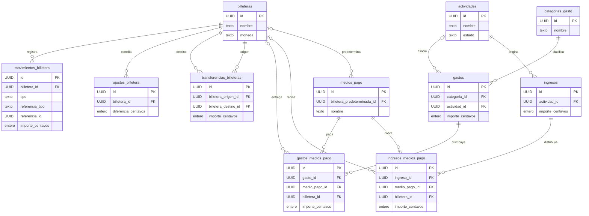

# Modelo de datos

Esquema V1 definido en `src/base-datos/migraciones/v1.ts` mediante una migración declarativa común a Web y Nativo. Los adaptadores traducirán las definiciones y sus restricciones a IndexedDB y SQLite en las tareas de implementación de cada motor. Todavía no se ejecutó sobre una base física.

Las once entidades TypeScript están definidas en `src/nucleo/entidades/`, con una base `EntidadAuditada`. Las propiedades del dominio usan camelCase en español (`actividadId`, `importeCentavos`, `creadoEn`); las columnas de persistencia usarán snake_case (`actividad_id`, `importe_centavos`, `creado_en`) mediante los adaptadores.

Los instantes de auditoría, conciliación y movimientos se representan como cadenas ISO 8601 en UTC. Las fechas de ingresos, gastos, transferencias y períodos de actividad usan `AAAA-MM-DD` sin zona horaria. La ausencia de datos opcionales se representa con `null` explícito. Estos tipos describen los datos y no validan UUID, formatos de fechas, enteros, signos, referencias ni consistencia financiera en ejecución; esa responsabilidad corresponde a servicios posteriores.

Los detalles heredan la moneda de su ingreso o gasto. Las transferencias se limitan a billeteras de la misma moneda; no se implementa conversión de divisas. Los movimientos usan la moneda de su billetera. Sus referencias apuntan a la operación de origen; en saldos iniciales, tipo e identidad de referencia son nulos. `AjusteBilletera.diferenciaCentavos` expresa saldo real menos saldo calculado y determina el signo del movimiento asociado.

## Entidades previstas

| Entidad | Propósito y relaciones |
| --- | --- |
| Actividad | Fuente de ingresos o trabajo, con estado y fechas opcionales. |
| MedioPago | Forma de pago o cobro, con billetera predeterminada opcional. |
| CategoriaGasto | Clasificación editable de gastos. |
| Billetera | Ubicación del dinero y moneda. |
| Ingreso | Registro asociado a una actividad. |
| DetalleIngresoMedioPago | Distribución del ingreso entre medios y billeteras. |
| Gasto | Registro con categoría y actividad opcional. |
| DetalleGastoMedioPago | Distribución del gasto entre medios y billeteras. |
| TransferenciaBilletera | Movimiento interno entre billeteras distintas. |
| MovimientoBilletera | Entrada o salida que constituye la fuente de verdad del saldo. |
| AjusteBilletera | Diferencia registrada durante una conciliación. |

## Convenciones

- Nombres propios en español; tablas y columnas en snake_case.
- Clave primaria `id` con UUID generado localmente; sin campo `uuid` adicional ni identidad autoincremental.
- Claves foráneas con sufijo `_id`, por ejemplo `actividad_id` y `billetera_origen_id`.
- Importes enteros en unidades menores, mediante `importe_centavos`; moneda inicial ARS.
- Auditoría con `creado_en`, `actualizado_en` y `eliminado_en` cuando corresponda; conservar registros históricos mediante borrado lógico o desactivación.
- Fechas de calendario como texto `AAAA-MM-DD`; instantes como texto ISO 8601 UTC. SQLite representará booleanos como enteros 0/1 e IndexedDB como booleanos. Ambos adaptadores deben validar los tipos, UUID y restricciones declaradas.

## Esquema V1 y relaciones

Todas las tablas tienen `id`, `creado_en`, `actualizado_en` y `eliminado_en`. Los campos son obligatorios salvo `permiteNulo: true` en la migración. Los importes y saldos son enteros seguros; los totales, detalles y transferencias son estrictamente positivos. Los movimientos admiten signos según su tipo; la diferencia de un ajuste debe ser distinta de cero e igual a saldo real menos saldo calculado. Las transferencias exigen origen y destino distintos. Las FK no eliminan historia en cascada.

| Tabla | Datos específicos |
| --- | --- |
| actividades | nombre, tipo, descripción, icono, color, fechas de inicio y fin, estado y activo. |
| categorias_gasto | nombre, icono, color y activo. |
| billeteras | nombre, tipo, icono, color, moneda, activo y conciliado_en. |
| medios_pago | nombre, icono, color, mostrar_en_carga_rapida, orden, billetera_predeterminada_id y activo. |
| ingresos | actividad_id, fecha, descripción, observaciones, moneda e importe_centavos. |
| ingresos_medios_pago | ingreso_id, medio_pago_id, billetera_id opcional e importe_centavos. |
| gastos | categoria_id, actividad_id opcional, fecha, descripción, observaciones, moneda e importe_centavos. |
| gastos_medios_pago | gasto_id, medio_pago_id, billetera_id opcional e importe_centavos. |
| transferencias_billeteras | billetera_origen_id, billetera_destino_id, importe_centavos, moneda, fecha y descripción. |
| ajustes_billetera | billetera_id, fecha, saldo_calculado_centavos, saldo_real_centavos, diferencia_centavos, motivo y observaciones. |
| movimientos_billetera | billetera_id, tipo, referencia_tipo, referencia_id, importe_centavos, fecha y descripción. |

La referencia de movimientos es polimórfica y no declara una FK a una tabla única. Los servicios verificarán conjuntamente referencia y tipo, signos, monedas de las billeteras, suma de detalles y creación de movimientos en la transacción de cada operación. Los catálogos son datos editables; la migración no inserta valores iniciales. No incluye cachés de saldos. El adaptador administra la versión de esquema fuera de estas once tablas de negocio.

El diagrama muestra relaciones físicas. La asociación polimórfica de movimientos con su operación se describe en `referencia_tipo` y `referencia_id`, sin inventar una FK múltiple.

## Operaciones monetarias

Las operaciones de dinero se centralizan en `src/nucleo/dinero/Importe.ts`: `crearImporte` recibe centavos enteros seguros, `sumarImportes` suma una lista de la misma moneda y `restarImportes` calcula una diferencia con signo. La moneda predeterminada es ARS; una suma sin argumentos devuelve cero ARS. Se rechazan fracciones, valores no finitos, monedas de formato inválido, mezclas de monedas y resultados fuera de ±`Number.MAX_SAFE_INTEGER`. Los cálculos usan BigInt internamente y devuelven enteros number para persistencia; nunca se persiste BigInt.

El formateo se separa en `src/compartido/dinero/formatearImporte.ts`, con idioma predeterminado `es-AR` y dos decimales. Conserva los centavos exactos, incluidos los negativos menores a un peso. El modelo actual representa monedas de dos decimales; monedas con otra cantidad de unidades menores requerirán ampliar el modelo. La interpretación de texto de formularios no se implementa en esta tarea.

Ingresos y gastos tienen detalles por medio de pago, sin columnas fijas para efectivo o tarjeta. Los movimientos usan importes positivos para entradas y negativos para salidas. Tipos previstos: `SALDO_INICIAL`, `INGRESO`, `GASTO`, `TRANSFERENCIA_ENTRADA`, `TRANSFERENCIA_SALIDA`, `AJUSTE_POSITIVO` y `AJUSTE_NEGATIVO`.

Una transferencia genera salida y entrada por el mismo importe sin modificar el resultado. El saldo inicial y las diferencias de conciliación se registran como movimientos; el saldo no se edita directamente. Una diferencia cero no genera ajuste.

## Índices V1

Los siete índices financieros exigidos y dos índices por cabecera de detalles están en src/base-datos/migraciones/indicesV1.ts, cada uno con su motivo. Se incluyen en V1 antes de su primera implementación física. Los adaptadores deben crearlos en la misma actualización de esquema; no se agregan índices de catálogo sin una necesidad medida.
